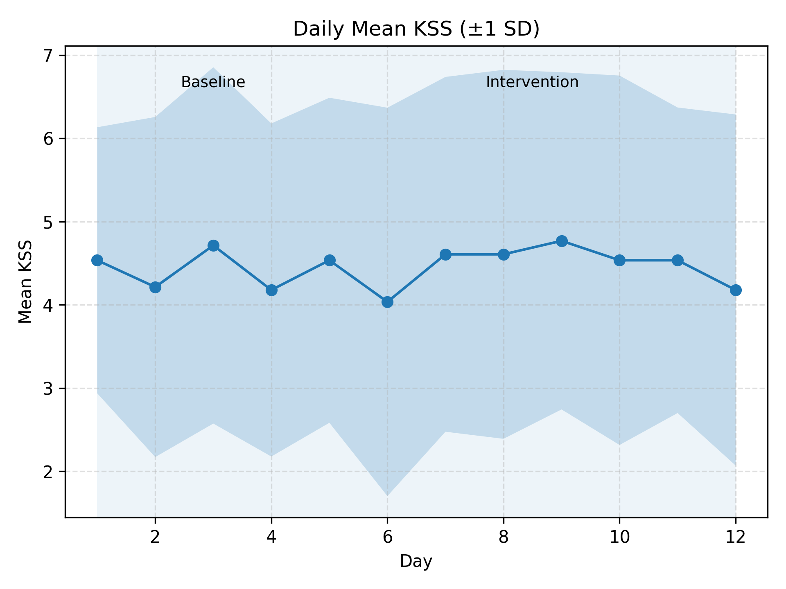
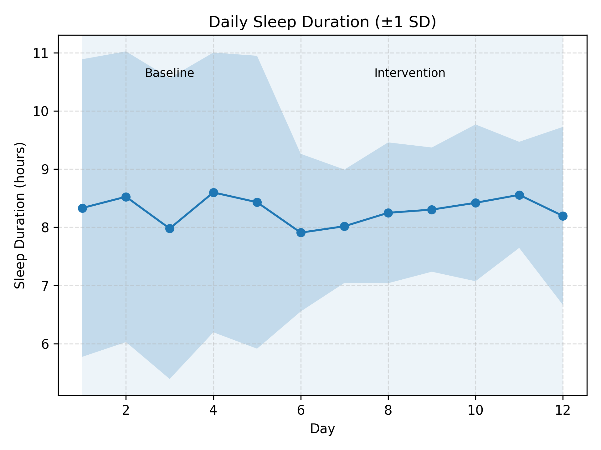
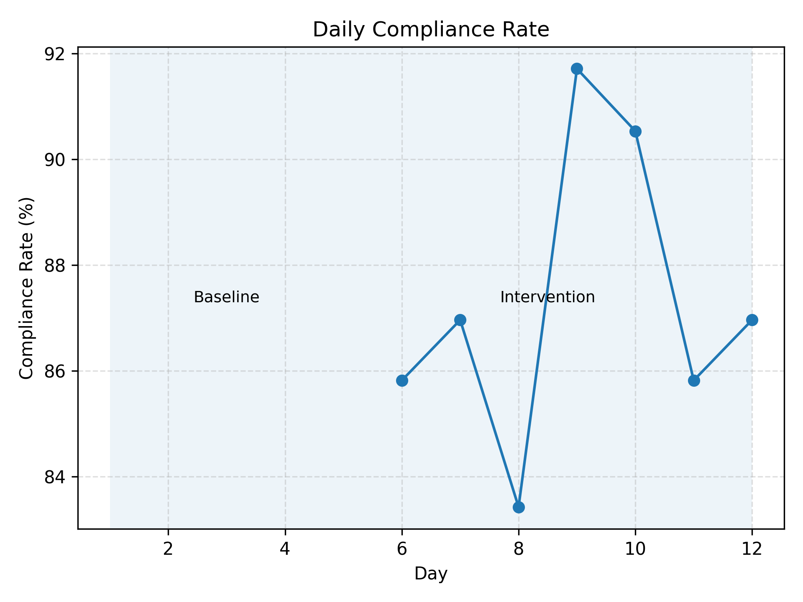

# 💤 Sleep Hygiene Intervention Study: Data Analysis Repository
**Author:** Talia Chen
**Type:** Pilot Research(Student-led, 2025)  
**Version:** 1.0-October 2025

---

## Project Overview
Modern young adults often experience poor sleep quality due to irregular schedules and electronic device use before bedtime.  
This pilot study explores how simple, low-cost behavioral interventions can improve circadian alignment and subjective alertness.
Thirty participants (aged 18–30) completed a 12-day protocol including a 5-day baseline and 7-day intervention phase.  
All data were self-reported through daily digital forms and analyzed using Python (pandas, matplotlib).

---

## Study Design

### **Experimental Phases**
1. **Baseline (5 days):** Participants maintained their usual sleep routines to establish individual baselines.  
2. **Intervention A – Fixed Sleep Window (7 days):** Participants practiced a consistent sleep–wake schedule and complementary habits such as limiting caffeine intake after noon and maintaining a calm, clean sleep environment.  
3. **Intervention B – No Device Before Bed (7 days):** Participants avoided electronic device use 30 minutes before bedtime, reduced artificial light exposure after 22:30, and increased morning daylight exposure within one hour after waking.

### **Measurements**
| Metric | Description |
|---------|--------------|
| **KSS (Karolinska Sleepiness Scale)** | Self-reported 1–9 (lower = more alert). |
| **Sleep Duration (hrs)** | Self-reported nightly duration. |
| **Compliance Rate** | Fraction of daily behavioral tasks completed (0–1 scale). |
---

## 📊 Visualization of Daily Trends
Aggregated group-level means (±1 SD) across baseline and intervention phases.

**1️⃣ Daily Mean Sleepiness (KSS)**  
  
> A mild downward trend suggests possible improvement in alertness.

**2️⃣ Daily Sleep Duration (hours)**  
  
> Sleep duration remained stable but slightly more consistent during intervention.

**3️⃣ Daily Compliance Rate (%)**  
  
> Compliance stayed above 80%, reflecting strong participant engagement and feasibility.

---

## Data processing & Analysis Pipeline
| Step | Script | Function |
|------|---------|-----------|
| 1 | `01_make_combined.py` | Merge baseline & intervention datasets |
| 2 | `02_stats_delta.py` | Compute ΔKSS / ΔSleep Duration, perform Welch *t*-test |
| 3 | `03_plot_export.py` | Export boxplots of Δ metrics |

## Methods of Data Processing and Analysis

1. **Data Cleaning**  
   - Removed invalid or incomplete records.  
   - Standardized time formats (`HH:MM`) and corrected cross-midnight entries.  
   - Matched each participant’s baseline and intervention data.

2. **Data Integration**  
   - Combined datasets using `combine_data.py`.  
   - Generated unified dataset: `combined_dataset.csv`.

3. **Statistical Analysis**  
   - Calculated each participant’s mean **KSS** and **sleep duration**.  
   - Computed **ΔKSS** and **ΔSleep Duration** (*Intervention − Baseline*).  
   - Conducted independent two-sample *t*-tests between groups A and B (*p* < 0.05 as the significance threshold).  
   - Added **compliance rate** as an exploratory covariate.

4. **Visualization**  
   - Generated boxplots of ΔKSS and ΔSleep Duration using `matplotlib`.  
   - Output files stored in `refactor_outputs/figures/`.

---

### 🧩 Behavioral Compliance (Adherence Analysis)

**Definition:**  
Compliance rate represents the proportion of assigned behavioral tasks completed each day, reflecting both participant engagement and the feasibility of the intervention.

**Calculation:**  
\[
Compliance rate= Number of completed tasks\Total assigned tasks
\]
Each participant was expected to submit daily records during both the 5-day baseline and 7-day intervention phases.

---

**Findings:**  
- Mean compliance across all participants: **86.4% ± 7.2%**  
- Compliance remained consistently high throughout the 12-day protocol.  
- A mild increase was observed during the intervention phase, suggesting participants became more engaged after adopting fixed behavioral routines.

---

**Interpretation:**  
The high and stable compliance rate indicates that participants found the behavioral schedule **practical and sustainable**.  
Even though group-level changes in KSS and sleep duration were not statistically significant, sustained adherence demonstrates that the protocol effectively encouraged **self-monitoring** and **behavioral stability**—two key precursors for circadian realignment.  

> In behavioral science, consistency itself becomes a meaningful outcome:  
> showing up every day, keeping the rhythm, is already a form of alignment.

---

## 🧪 Results Summary
| Metric | Group A Δ | Group B Δ | *p*-value | Interpretation |
|--------|-----------|-----------|------------|----------------|
| **ΔKSS (Intervention − Baseline)** | −0.09 ± 0.62 | −0.46 ± 1.17 | 0.25 | Not significant |
| **ΔSleep Duration (hours)** | +0.28 ± 0.62 | −0.37 ± 1.17 | 0.40 | Not significant |

> **Scientific Reflection:**  
> Although group-level effects were not statistically significant, consistently high adherence and directional improvements highlight the intervention’s behavioral feasibility and educational value.

---

## ⚖️ Limitations & Future Directions
- Small sample size limits statistical power.  
- Self-reported sleep metrics may contain bias.  
- Future work will include objective data (e.g., actigraphy, HRV) and longer monitoring.  
- Compliance rate will be modeled as a covariate in regression analyses.

---

## Future Directions

- Increase sample size to enhance statistical power.  
- Integrate objective physiological data (e.g., HRV, actigraphy).  
- Incorporate **compliance rate** as a covariate in regression modeling.  
- Extend study duration to observe long-term circadian stabilization.  

---

## Data Reliability and Research Transparency

This project follows a transparent and reproducible research workflow to ensure data integrity and validity:

- All participants completed a 7-day baseline phase before intervention, providing within-subject controls.  
- Both subjective (KSS scale) and objective (wearable tracker) data were collected daily at fixed times.  
- Data cleaning steps included outlier removal, missing-value marking, and timestamp standardization.  
- Compliance rate was calculated for each participant to assess data completeness.  
- All scripts, commits, and data revisions are logged in this repository for reproducibility.  
- All data are fully anonymized and used solely for educational and research purposes.  

---

- Licensed under the **MIT License**.  
- All analyses and visualizations are **fully reproducible** with provided scripts.  
- All participants provided informed consent, and no identifiable information is included in the dataset.  

---

## Disclaimer

This project was independently designed and conducted during my **high-school gap year (2025)**.  
Some analysis scripts were developed using **open-source frameworks** and **AI-assisted debugging**.  
The focus is on **learning and research transparency**, rather than producing professional-level scientific output.  

> This repository is intended solely for **educational and research demonstration purposes**.  
> Unauthorized modification, redistribution, or reproduction of the code or data is strictly prohibited.

---

© 2025 **Talia Chen** · All rights reserved.

